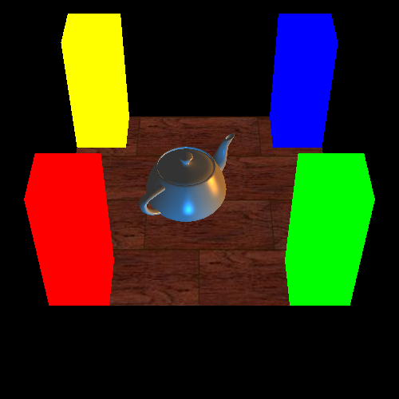
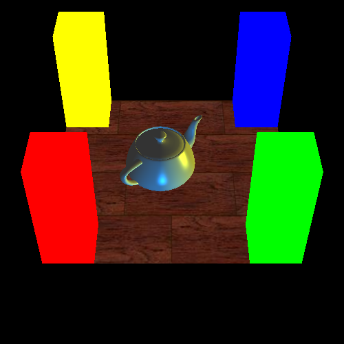
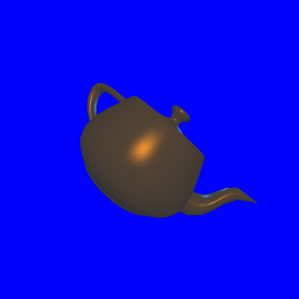

# cse167x
UC San DiegoX Computer Graphics

## Lecture 1 (Course Overview)

### Graphics Pipeline

- Pipeline Definition
  - Modeling (creating 3D geometry and textures)
  - Animation
  - Rendering (create realistic images considering geometry and animation)
 
- Rasterization (homework 2)
  - Goes through all geometric primitives, determine where they exist on the screen

- Raytracing (homework 3)
  - Goes through all pixels, and determines what geometry are in that pixel

### Historical Methods

- Diffuse lighting (Gourad), smooth shading, lessens facet edges
- Specular lighting (Phong), adds highlights, plastic appearance with body color component and specular highlight
- Curved surface and texture (Blinn)
- Z-Buffer (Catmull), hidden surface
- Global illumination (Whitted), recursive raytracing, bubble refraction image
- Radiosity (Goral, Torrance), interacting and reflecting light where one object illuminates another
- Rendering equation (Kajiya), unified many of the methods and visual phenomena

## Lecture 2 (Basic Math)

### Dot Products

- "Scalar" product
```math
\mathbf{a} \cdot \mathbf{b}= \mathbf{b} \cdot {a} = x_a x_b + y_a y_b = \| \mathbf{a} \|  \| \mathbf{b} \| \cos \phi
```
- Angle $$\phi$$ between two vectors
```math
\phi = \cos^{-1} \left( \frac{\mathbf{a} \cdot \mathbf{b}}{ \| \mathbf{a} \| \| \mathbf{b} \| }  \right)
```
- Used to project one vector onto another
```math
\| \mathbf{b} \rightarrow \mathbf{a} \| = \| \mathbf{b} \| \cos \phi = \frac{ \mathbf{a} \cdot \mathbf{b} } { \| a \| }
```

### Cross Products

- "Vector" product, orthogonal to the two initial vectors
```math
\mathbf{a} \times \mathbf{b} = -\mathbf{b} \times \mathbf{a}
```

- Used to calculate sine of the angle between vectors
```math
\| \mathbf{a} \times \mathbf{b} \| = \| \mathbf{a} \| \| \mathbf{b} \| \sin \phi
```

- Represented using the determinant $$| \cdot |$$
```math
\mathbf{a} \times \mathbf{b} =
\begin{vmatrix}
\mathbf{x} & \mathbf{y} & \mathbf{z} \\
x_a & y_a & z_a \\
x_b & y_b & z_b 
\end{vmatrix} =
\begin{pmatrix}
y_a z_b - y_b z_a \\
z_a x_b - z_b x_a \\
x_a y_b - x_b y_a
\end{pmatrix}
```

- Can be calculated using the skew-symmetric "dual" matrix of $$\mathbf{a}$$, referred as $$\mathbf{A}^*$$
```math
\mathbf{a} \times \mathbf{b} = \mathbf{A}^* \mathbf{b} =
\begin{bmatrix}
0 & -z_a & y_a \\
z_a & 0 & -x_a \\
-y_a & x_a & 0 
\end{bmatrix}
\begin{pmatrix}
x_b \\ y_b \\ z_b
\end{pmatrix}
```

### Orthonormal Coordinate Frames
- Global, local, world, model, parts of model
- Constructing a coordinate frame (u,v,w)
```math
\mathbf{w} = \frac{ \mathbf{a} }{ \| \mathbf{a} \| }
```
```math
\mathbf{u} = \frac{ \mathbf{b} \times \mathbf{w} }{ \| \mathbf{b} \times \mathbf{w}  \| }
```
```math
\mathbf{v} = \mathbf{w} \times \mathbf{u}
```
- This is often used where we are associated $$\mathbf{a}$$ with a viewing direction, and we are using a second vector $$\mathbf{b}$$ which is an up vector

### Matrices
- In matrix multiplication, element $$(i, j)$$ is the dot product of the vector defined by row $$i$$ of the first matrix with column $$j$$ of the second matrix
- Not commutative, $$\mathbf{AB} \neq \mathbf{BA}$$ in general, can be dimensionally incompatible

### Homework 0
- First homework is almost entirely to set up the system to compile a demo C++ app that calls on dependencies that will be used in subsequent homework projects
- The FAQ in the course indicates it is *required* to run this demo using Rosetta on Apple Silicon; this is *not* true
- Review of the discussion board, particularly [this post](https://discussions.edx.org/course-v1:UCSanDiegoX+CSE167x+2T2018/posts/61ddb33b6100fc048488dc3f) provides explanation of how to configure your system on an M1 or more recent chip
- Brew should be installed, though the default, ARM-native version will work, counter to what the FAQ says
- Install the dependencies using:
```console
brew install glew freeglut mesa-glu freeimage  # brew installed in /opt/homebrew
```
- [This commit](https://github.com/radcli14/cse167x/commit/25a193ef776406de68e326c7dc18a79142daa292) shows changes to the Makefile which are required to make sure the dependencies get linked properly, particularly the change of the source paths in the `INCFLAGS` and `LDFLAGS`
- The same commit shows the change in the C++ file to change the highlight color, resulting renders look as follows:

| Screenshot 1                                   | Screenshot 2                                   |
|------------------------------------------------|------------------------------------------------|
|  |  |

## Lecture 3 (Transforms 1)

### Basic 2D Transforms
- Scaling transformation
```math
\begin{bmatrix}
s_x && 0 \\ 0 && s_y 
\end{bmatrix}
\begin{bmatrix}
x \\ y
\end{bmatrix} =
\begin{bmatrix} s_x x \\ s_y y \end{bmatrix}
```
- Shear transform, turns a rectangular into a parallelogram
```math
\begin{bmatrix}
1 && a \\ 0 && 1
\end{bmatrix}
\begin{bmatrix}
x \\ y
\end{bmatrix} =
\begin{bmatrix}
x + a y \\ y
\end{bmatrix}
```

### Composing Transforms
- Not commutative, order matters when combining rotations and scales
- Rotation prior to a scale has similar effect to a scale
- Last transformation applied needs to be the first one undone in an inverse operation

### 3D Rotations
- 2D case of rotation
```math
\begin{bmatrix} x^\prime \\ y^\prime \end{bmatrix} =
\begin{bmatrix}
\cos \theta && -\sin \theta \\
\sin \theta && \cos \theta
\end{bmatrix}
\begin{bmatrix} x \\ y \end{bmatrix} 
```
- 3D case, rows of matrix are unit vectors in a new coordinate frame, form a projection of a point into new coordinate frame
- Inverse or transpose of the rotation matrix transpose project `uvw` vector back into the original `xyz` frame
- Not commutative, a rotation by $$x$$ before $$y$$ is not the same as a rotation by $$y$$ before $$x$$
- Angle axis rotations, rotate vector $$b$$ by an angle $$\theta$$ about vector $$a$$
  - Vector $$\mathbf{b}$$ may be considered to have a component $$\mathbf{b}_\parallel$$ parallel to $$a$$ and a component orthogonal  
  - $$\mathbf{b}_\parallel = (\mathbf{a} \cdot \mathbf{b}) \mathbf{a}$$
  - $$\mathbf{b}_\perp = \mathbf{b} - \mathbf{b}_\parallel$$
  - Vector $$\mathbf{c}$$ is parallel to both $$\mathbf{a}$$ and $$\mathbf{b}$$
  - 
  - "Rodrigues Rotation Formula"
  - 

## Lecture 4 (Transforms 2)

### Homogeneous Coordinates
- Add a fourth coordinate to the xyz vector, call it "w", can use "w=1"
- Translation in matrix format, example, translate by 5 in x
```math
\begin{bmatrix} x+5 \\ y \\ z \\ 1 \end{bmatrix} =
\begin{bmatrix}
1 & 0 & 0 & 5 \\
0 & 1 & 0 & 0 \\
0 & 0 & 1 & 0 \\
0 & 0 & 0 & 1
\end{bmatrix}
\begin{bmatrix} x \\ y \\ z \\ 1 \end{bmatrix} =
\begin{bmatrix} x \\ y \\ z \\ w \end{bmatrix}
```
- The "unhomogenous" coordinates are the case where $$w \neq 1$$, get "homogeneous" by dividing by w
- Modifying w can provide additional operations
- Homogeneous provide a unified framework of a transform matrix for translation, viewing, rotation, and can concatenate homogenous coordinates
- General translation matrix
```math
\mathbf{T} =
\begin{bmatrix}
1 & 0 & 0 & T_x \\
0 & 1 & 0 & T_y \\
0 & 0 & 1 & T_z \\
0 & 0 & 0 & 1
\end{bmatrix} =
\begin{bmatrix}
\mathbf{I}_3 & \boldsymbol{T} \\
0 & 1
\end{bmatrix}
```
- In the above, the translation is in the reference coordinates, applied first, then the rotation

### Finding Normal Transformations
- Important in lighting, intensity on a surface depends on angle between the light and the surface, highlights depend on the angle between the viewer, surface normal, and light source
- Normal transforms do not follow point transforms (tangents do follow point transforms, as they are points)
- Normals are orthogonal to the tangents, so dot product with tangents equals zero
- Normal transform matrix is inverse transpose of the tangent transform matrix, only applies to the upper 3x3, not to the homogeneous coordinate

### Rotations and Coordinate Frames
- Defines both an origin position and an orientation
- Rows of a rotation matrix are three unit vectors that make up the frame

### Derivation of gluLookAt
- Derives a 4x4 matrix to view objects and position a camera in the world
- `gluLookAt(eyex, eyey, eyez, centerx, centery, centerz, upx, upy, upz`
- Camera is eye, looking at center, with up vector
- Creates a coordinate frame, defines a rotation, and applies a transformation
- Coordinate frame calculated according to "orthornormal coordinate frame" section earlier, $$a$$ vector is eye-center, $$b$$ vector is up
- In OpenGL convention, camera always looks in the -Z direction
- Rows of rotation matrix are the the new unit vectors constructed above
- Translation is applied first to bring the camera to its new origin before rotating it
- 

## Lecture 5: Viewing

### Orthographic Projection
- Projection of 3D into 2D space
- Viewing transformations will use the last row, w not always equal to one
- Trivial orthographic transformation transforms 3D to 2D by dropping the Z-coordinate after transformation into camera frame
- Have a general cube in 3D, map it to [[-1, 1], [-1, 1], [-1, 1]]
- First center, then scale, replace far and near with their negative values for the -Z viewing conventions
- 

### Viewing Perspective
- Camera is "center of projection"
- $$ x^\prime = d \frac{x}{z} $$ simple formula, implies how size shifts as viewing distance changes
- 

### `gluPerpective`
- Viewing pipeline is a `gluLookAt` followed by a `gluPerspective`
- Viewing frustrum, anything before near or after far gets blocked out
- 
- Field of view defined in Y, aspect ratio defines width to height
- `gluPerspective(fovy, aspect, znear, zfar)`, near and far must be >0
- 
- 
- Important not to set near plane to zero or far plane to infinity, either of these would destroy depth resolution
- Less sensitive to far plane, it can be very large, but it is important for near plane to coincide with your objects
- 
- Lighting is performed in eye coordinates

## Homework 1
- The purpose of this assignment is to implement a series of functions required to render a teapot, and orbit the position of the camera
- All code changes are contained in the [`Transform.cpp`](https://github.com/radcli14/cse167x/blob/main/hw1-linux_osx/Transform.cpp) file
- The rotate method creates a rotation matrix based on an angle in degrees and a rotation axis, and you must return a 3x3 matrix based on the Rodrigues equation
- The left and up methods reposition the camera "eye" based on an angle in degrees in a certain direction, for the left method, the direction is just the current up vector, for the up method, you must calculate the right vector based on a cross product, and normalize it.
- The lookAt method is simply a clone of GLM's built-in lookAt method
- Results are various rendered images of the teapot, at variation combinations of rotations, like this:


## Lecture 6 (OpenGL 1)

### Overview
- Introduced in 1992, today maintained by Khronos group
- Scan conversion / rasterization is mapping 3d geometry locations with pixel locations
- Vertex shader performs geometry primitive operations
- Fragment programming (shaders) interact with the graphics, GPU
- Operates in parallel on all fragments

### Buffers and Matrices
- Color (front/back/left/right), depth (z)
- Buffer arrays manage vertices
- 
- 
- Two parts to viewing, object positioning, and view projection
- Terminology of model view refers to positioning of objects as if camera were at the origin pointing in -Z
- GLM library replaced many deprecated functions from "old" OpenGL

### Window System and Callbacks
- Window system interactions are not part of OpenGL
- This is where GLUT is used
- 
- Callbacks are used to handle specifying the size/shape of a window, mouse/keyboard interactions, etc

### Drawing
- Modern OpenGL has fewer primitives, removed quads, general polygons and quad strips
- Currently points, lines, triangles, triangle strips, and triangle fans
- More complex shapes need to be converted into triangles
- Previously would set a color of a vertex prior to its position
- Modern OpenGL uses a concept of "Vertex Array Objects" (vertices -> colors -> indices/elements)
- 
- 
- 
- 
- 
- Note that .frag and .vert shaders are files, but they could just be strings in the program, kept separately for organization

### Initializing Shaders
- Rasterization -> taking vertices of triangles and determining which pixels they occupy on screen
- Vertex shader is called separately for each vertex in parallel
- For each primitive, a fragment is generated for each pixel the primitive covers
- For each fragment, the user generated fragment shader is called, shading a lighting calculations are performed, and Z-buffer test for depth and occlusion
- Shaders are compiled on demand, when initialized, because they are GPU code that does not necessarily have same instruction set as the host CPU

## Lecture 7 (OpenGL Shading)

### Motivation
- Flat shading: entire face has single color from one vertex
- Smooth (Gourad) shading: colors are determined from multiple vertices and interpolated
- Specular shading involves interpolating the normals from each vertex
- 32-bit color assigns 8 bits to each color in the RGBA spectrum
- OpenGL normalizes colors from 0->255 into range 0->1

### Gourad and Phong
- Gourad performs interpolation first in the vertical then horizontal, current implementation more efficient
- Phong illumination model used with specular or glossy materials
  - For plastic materials, highlight is color of light source (not the object)
  - For metallic materials, highlight is color of materials
  - Roughness blurs the highlights
- Phong shading produces the highlights, interpolates the normals before colors

### Lighting and Shading
- Point light source has a position in the world and color, uses a quadratic attenuation function
```math
atten = \frac{1}{k_c + k_l d + k_q d^2}
```
- Directional light sources include no attenuation function
- With complex shapes, vertex normals may be based on averaging nearby face normals
- Emissive term, only valid when looking directly at the material
- Ambient term, even when there is no source in the scene, a constant light value that comes from all directions
- Diffuse term, light that reflects equally in all directions, includes cosine term N * L from the normal dotted with light vector
- 
- Specular term, light reflection in the mirror direction, with some scatter, can raise the cosine term of the angle between mirror vector and view vector to some power to vary roughness
- 
- 

### Fragment Shader
- Input vertex, normals, and texture coordinates provided by vertex shader
- Output is a fragment color
- Ambient, diffuse, specular are RGB colors, shininess is a float value, are material properties
- Lambert shading is the dot product of the surface normal to the direction of the light source, times diffuse color
- Phong shading is the dot product of the surface normal with the half vector between the light and the viewer, times the specular color, times the light color, times the dot product above raised to the shininess power
- Lambert and Phong are added and returned as the `retval`
- 
- Lights transform like other objects, but only by model view, not projection
- `glUniform` essentially sets a uniform variable to a specific value. If the value on the CPU host program is changed after `glUniform` is called, the shader retains the value from when `glUniform` was actually called.
  
## Lecture 8 OpenGL 2

### Geometry
- Must set up buffers for objects, elements, vertices, and normals
- To add per-vertex color to our shape in modern OpenGL, what must we provide in addition to draw code without color? We must change the client state to GL_COLOR_ARRAY and bind the appropriate buffer for per-vertex colors. A glUniform call will not operate per-vertex, and we do not need to "unbind" existing buffers.

### Matrix Stacks

- Push and pop matrix operations for the model view stack, push to the top of the stack, pop takes the matrix from the top of the stack and returns it
- Changing the order of drawing will place an item (the floor) in front of items that were drawn before it, if Z-buffering not used
- What do shaders know about matrix stacks? Matrices are much like any other shader variable. The data structure used to maintain and define the values in the host program is not important to the shader. The shader will only see whichever value is passed to it. Although it is true that the shader uses the matrix at the top of the stack, you are passing the matrix itself, and not the stack, so the shader will only see a matrix and have no knowledge of its origin as being from the top of the stack. You could conceivably use a non-stack data structure, and pass the correct matrices to the shader programs, and your scene would be drawn correctly, according to the matrices you pass in. In old OpenGL, this binding is implicit when an object is drawn.

### Z-Buffer
- Double-buffering: render into background, swap to foreground when finished
- Z-buffer, for each pixel, only store closest fragment, replace if a new object is closer
- 

### Animation
- By updating the position in every draw call, will the speed of the animation be consistent? No. The speed at which the draw function is called is not consistent, even within a specific system.

### Texture
- Use images instead of polygons to represent detail
- Added in a fragment shader
- Each vertex must have a texture coordinate to apply texture mapping
- Rasterizing will calculate a texture coordinate for each pixel
- Can we conceivably change the shape of an object using a texture? Yes. We can change the location of every vertex using the vertex shader.

